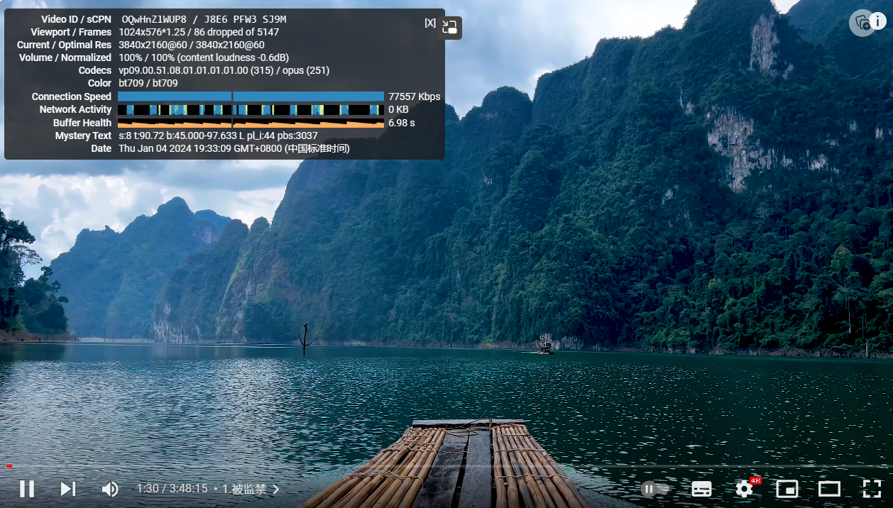

# Trojanlinks
# 每小时大概更新三次
免费节点都爬取自网络，请勿用于非法用途  
|  工具  | Android  | Windows  |  
|  ----  | ----   | ----  |  
| v2ray  | [v2rayNG](https://github.com/2dust/v2rayNG/releases) | [v2rayN](https://github.com/2dust/v2rayN/releases) |
| ssrray  | [SSRRAY](https://github.com/xxf098/shadowsocksr-v2ray-trojan-android/releases) |  [无]|
  
# 更多分享尽在TG群组
### https://t.me/+7cXPoNsa0p9lMTk1
### 加入电报群组，可及时获取订阅更新情况





### Trojan订阅链接
- `https://raw.githubusercontent.com/Huibq/TrojanLinks/master/links/trojan`  源
- `https://raw.staticdn.net/Huibq/TrojanLinks/master/links/trojan`  CDN

### vmess订阅链接
- `https://raw.githubusercontent.com/Huibq/TrojanLinks/master/links/vmess`  源
- `https://raw.staticdn.net/Huibq/TrojanLinks/master/links/vmess`  CDN

### vless订阅链接
- `https://raw.githubusercontent.com/Huibq/TrojanLinks/master/links/vless`  源
- `https://raw.staticdn.net/Huibq/TrojanLinks/master/links/vless`  CDN

### SSR订阅
- `https://raw.githubusercontent.com/Huibq/TrojanLinks/master/links/ssr`  源
- `https://raw.staticdn.net/Huibq/TrojanLinks/master/links/ssr`  CDN

### SS订阅
- `https://raw.githubusercontent.com/Huibq/TrojanLinks/master/links/ss_with_plugin`  源
- `https://raw.staticdn.net/Huibq/TrojanLinks/master/links/ss_with_plugin`  CDN

### 新SS节点
- `https://raw.githubusercontent.com/Huibq/TrojanLinks/master/links/ss`  源
- `https://raw.staticdn.net/Huibq/TrojanLinks/master/links/ss`  CDN


### 待更新 欢迎Star
```any
1.支持clash订阅  （待更新）
2.增加爬取数量   （已更新）
...
```
